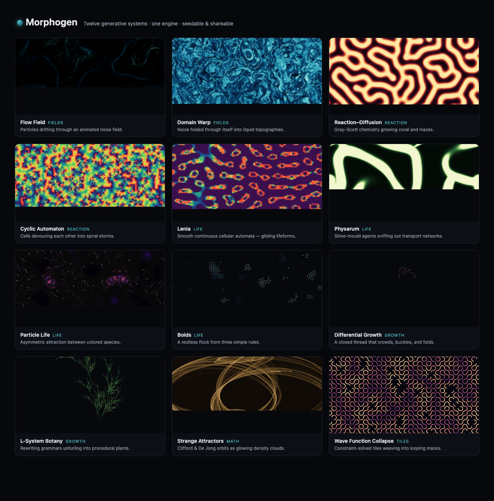

<div align="center">

# Morphogen

**A studio of generative and artificial-life systems, in one page.**

Flow fields · reaction–diffusion · particle life · Lenia · physarum · strange attractors · L-systems · differential growth · boids · wave-function-collapse · cyclic automata · domain-warped noise

*Seedable. Tunable. Shareable. No build step, no dependencies, no network.*

</div>



---

Morphogen is a single-page playground for **morphogenesis** — the way complex
form emerges from simple local rules. Twelve different generative worlds share
one engine: the same seeding, the same auto-generated controls, the same export
and sharing. Pick a system, turn the knobs, scrub a seed, and watch patterns
grow. Every render is reproducible and every render is a URL.

## Quick start

No dependencies. You only need a static file server because the source uses ES
modules (browsers block module loading over `file://`).

```bash
# 1. Run the dev server and open the studio
npm run dev            # → http://localhost:5178/

# 2. Run the test suite (deterministic core)
npm test

# 3. Build a single, self-contained, double-clickable file
npm run build          # → dist/morphogen.html
```

`dist/morphogen.html` has **everything inlined** — open it directly in any
modern browser, mail it to a friend, drop it on a USB stick. It still works
offline.

## What's inside

| System | Family | What it is |
|---|---|---|
| **Flow Field** | Fields | Particles advected through an animated simplex-noise field, leaving trails. |
| **Domain Warp** | Fields | fBm noise fed back into itself, producing slow marbled clouds. |
| **Reaction–Diffusion** | Reaction | Gray–Scott chemistry growing coral, spots, and mazes. Paint to seed. |
| **Cyclic Automaton** | Reaction | Rock-paper-scissors cells that self-organize into spiral waves. |
| **Lenia** | Life | Smooth continuous cellular automata — drifting, gliding lifeforms. |
| **Physarum** | Life | Slime-mould agents that sniff out and reinforce transport networks. |
| **Particle Life** | Life | Asymmetric attraction between colored species; emergent cells and creatures. |
| **Boids** | Life | Flocking from three rules: separation, alignment, cohesion. |
| **Differential Growth** | Growth | A closed curve that crowds and folds into brain-coral. |
| **L-System Botany** | Growth | Rewriting grammars grown into procedural plants and fractals. |
| **Strange Attractors** | Math | Clifford / De Jong / Svensson orbits as glowing density clouds. |
| **Wave Function Collapse** | Tiles | Constraint-solved tilings that knit themselves together. |

## Controls

| Key | Action | | Key | Action |
|---|---|---|---|---|
| `Space` | Play / pause | | `E` | Export PNG |
| `R` | Randomize parameters | | `G` | Open the system gallery |
| `S` | New random seed | | `.` | Step one frame |
| `N` | Restart current system | | drag | Interact with the canvas |

- **Seed** — type any word or number. The same seed always reproduces the same
  run. `⤮` rolls a fresh memorable word-seed.
- **🔗 Share** — copies a URL that encodes the system, seed, and every parameter.
  Open it anywhere to recreate the exact frame.
- **⏺ Record** — captures the canvas to a WebM video (where the browser supports
  `MediaRecorder`).
- **Drag the canvas** — most systems respond to the pointer (seed reaction–diffusion,
  herd the boids, disturb the flow field, paint life into Lenia).

## How it works

Every system implements one small interface — `meta`, a declarative list of
`params`, an `init(context)`, and a `step(context)`. The engine supplies a
**SystemContext** each frame with a seeded RNG, seeded simplex noise, the canvas,
timing, live parameter values, and the pointer. The engine handles everything
else: device-pixel-ratio sizing, the animation loop, building the control panel
from the param list, serializing state to the URL, PNG export, and WebM capture.

Because the only sources of randomness are the seeded RNG and seeded noise,
**runs are fully deterministic** — which is what makes a seed in a URL enough to
recreate any image exactly.

See [docs/ARCHITECTURE.md](docs/ARCHITECTURE.md) for the engine design and
[docs/SYSTEMS.md](docs/SYSTEMS.md) for a deep dive on each algorithm.

## Project structure

```
morphogen/
├── index.html              # app shell
├── styles.css              # studio chrome (dark theme)
├── src/
│   ├── main.js             # boot: register systems, wire the UI
│   ├── engine/
│   │   ├── engine.js        # lifecycle + SystemContext (the heart)
│   │   ├── prng.js          # seedable RNG (mulberry32 + helpers)
│   │   ├── noise.js         # seedable simplex noise + fBm
│   │   ├── mathx.js         # scalar + vector math
│   │   ├── color.js         # palettes and ramp sampling
│   │   ├── canvas.js        # DPR sizing, PNG export, WebM recording
│   │   ├── params.js        # param spec → DOM controls
│   │   ├── urlstate.js      # state ⇄ URL hash
│   │   ├── loop.js          # requestAnimationFrame driver + FPS
│   │   └── registry.js      # system registry
│   ├── systems/             # one file per generative system
│   └── ui/gallery.js        # system switcher overlay
├── test/                   # node:test suite for the deterministic core
├── build.js                # single-file bundler (blob-URL module graph)
└── scripts/                # dev server, syntax checker, generators
```

## Adding a system

1. Create `src/systems/yoursystem.js` that default-exports a `create()` factory
   implementing the interface (copy `flowfield.js` — it's the reference).
2. Import and register it in `src/main.js`.

That's the whole API. The control panel, seeding, URL sharing, export, and
recording come for free.

## License

MIT. Built as a demonstration of how much cohesive, working software can be
produced in a single focused session.
